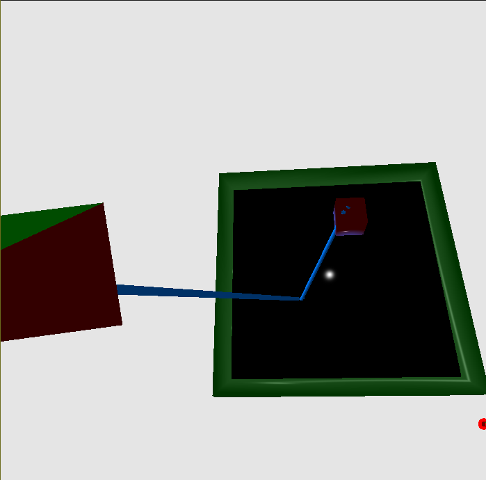

# Computer Graphics Project - Ray Tracing

#### run.sh

```
./run.sh    # normal build & run
./run.sh 0  # run the application without rebuilding
./run.sh 1  # rebuild everything with GDB debugger enabled
```

#### Debugging

- [a quick C++ debugging tutorial with GDB debugger](http://www.unknownroad.com/rtfm/gdbtut/gdbsegfault.html)
    - useful for debugging `segmentation fault`

##### Run

    gdb ./build/raytracing


# REPORT


MINIMUM REQUIREMENTS

1. Perform ray intersections with planes, triangles, and bounding boxes.
	Joaquin, Lazer, Yanqing, Jacob

Picture: Debug ray with a simple obj

2. Computate shading at the ?rst impact point (di?use and specular).
	Joaquin, Jacob
Picture: Two pictures (with and without shading) for comparison


3. Perform recursive raytracing for re?ections to simulate specular materials. 
	Joaquin, Jacob, lazer


4. Calculate hard shadows from a point light. 
	Joaquin, Lazer, Moshiur, Yanqing, Jacob, Shivani
One picture: Pic with hard shadows 

5. Calculate soft shadows from a spherical light centered at a point light.
	Joaquin,Shivani, Lazer, Moshiur, Yanqing, Jacob
Two pcitures: pic with soft shadows

6. Show an interactive display in OpenGL of the 3D scene and a debug ray tracer. A ray from a chosen pixel should be shown via OpenGL, illustrating the interactions with the surfaces. 
	Lazer




7. Implement a (simple) acceleration structure. 
	Jacob, Joaquin, Moshiur and Yanqing, Shivani, Lazer

Pitures: boxes


8. Show a scene created by the group, exported as a wavefront object (OBJ) and directly loaded into the application.
	Shivani, Joaquin, Yanqing
Picture: finl pic


 
EXTENSIONS 

1. Implementing a more complex scene hierarchy. 
	Shivani, Joaquin, Jacob, Moshiur, Yanqing, lazer

Pitures: code

2. Multicore support of the ray tracer (implementing additional threads).
	
Picture: 

3. A numerical evaluation of the performance of your ray tracer.
	Lazer

Picture: terminal

4. Supporting refraction and the display of transparent objects. 
	Yanqing 
Picture: Picture of debug rays 


5. An illustration of interesting test or corner cases. 
	Joaquin, Shivani, Jacob, Yanqing

Picture: picture from slides

6. Extending the debugger to show the nth re?ection of a ray via the keyboard, or triggering a ray highlighting and showing command line output of the selected ray’s properties. 
	Lazer

Picture: Picture of debug rays --> Lazer
