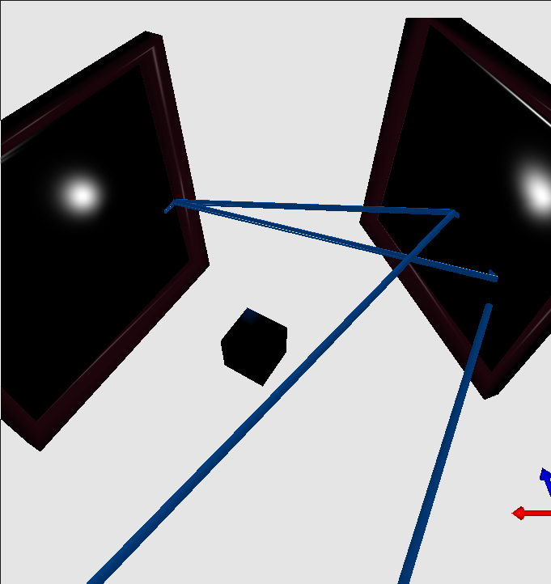
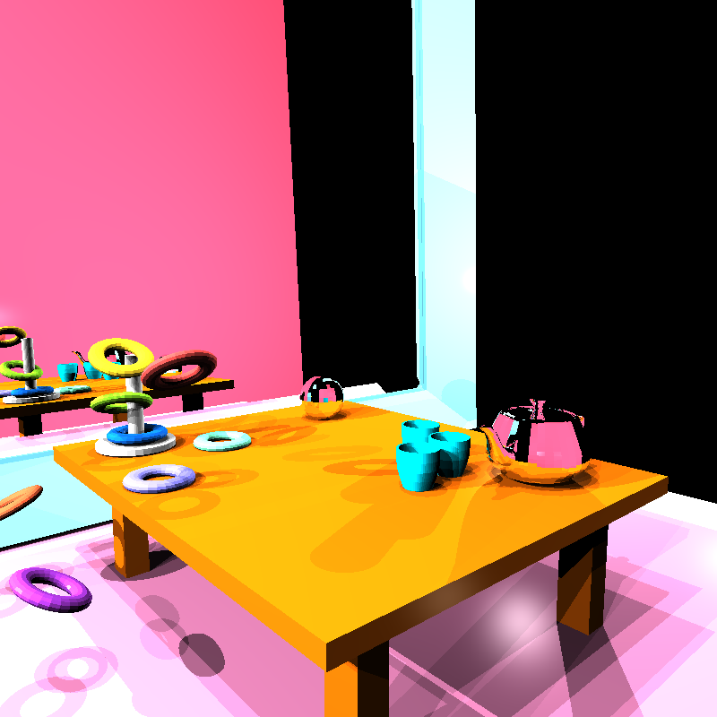
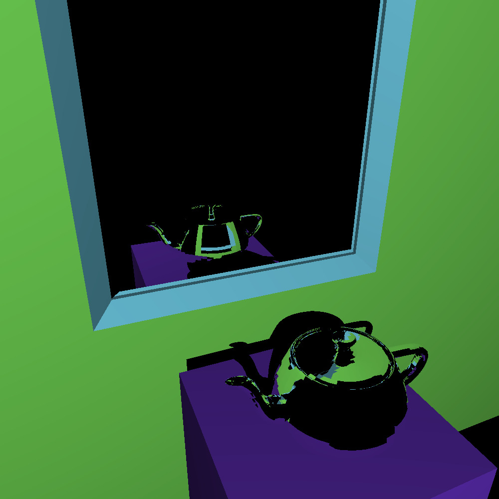
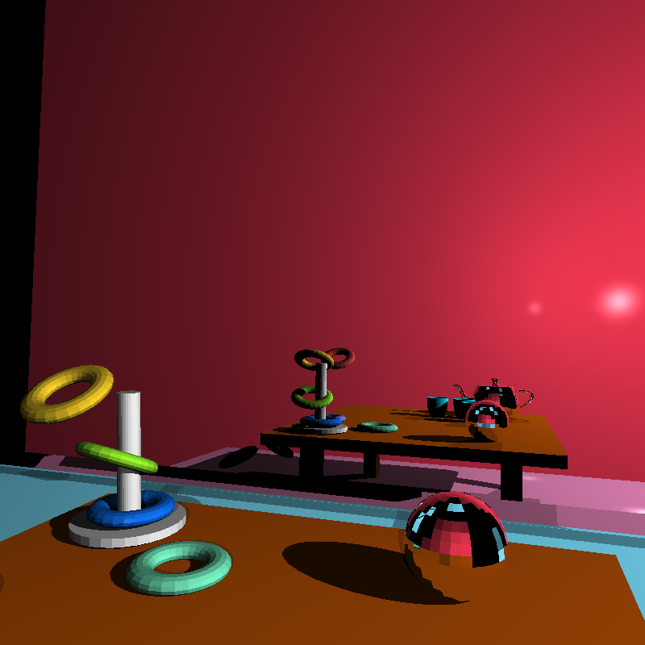
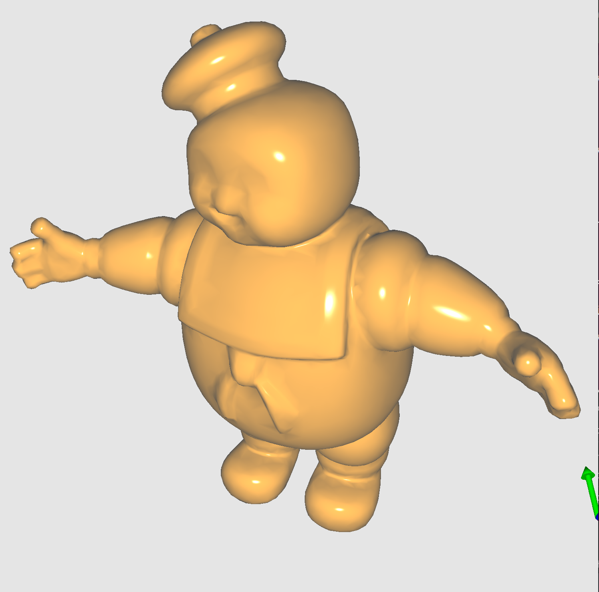
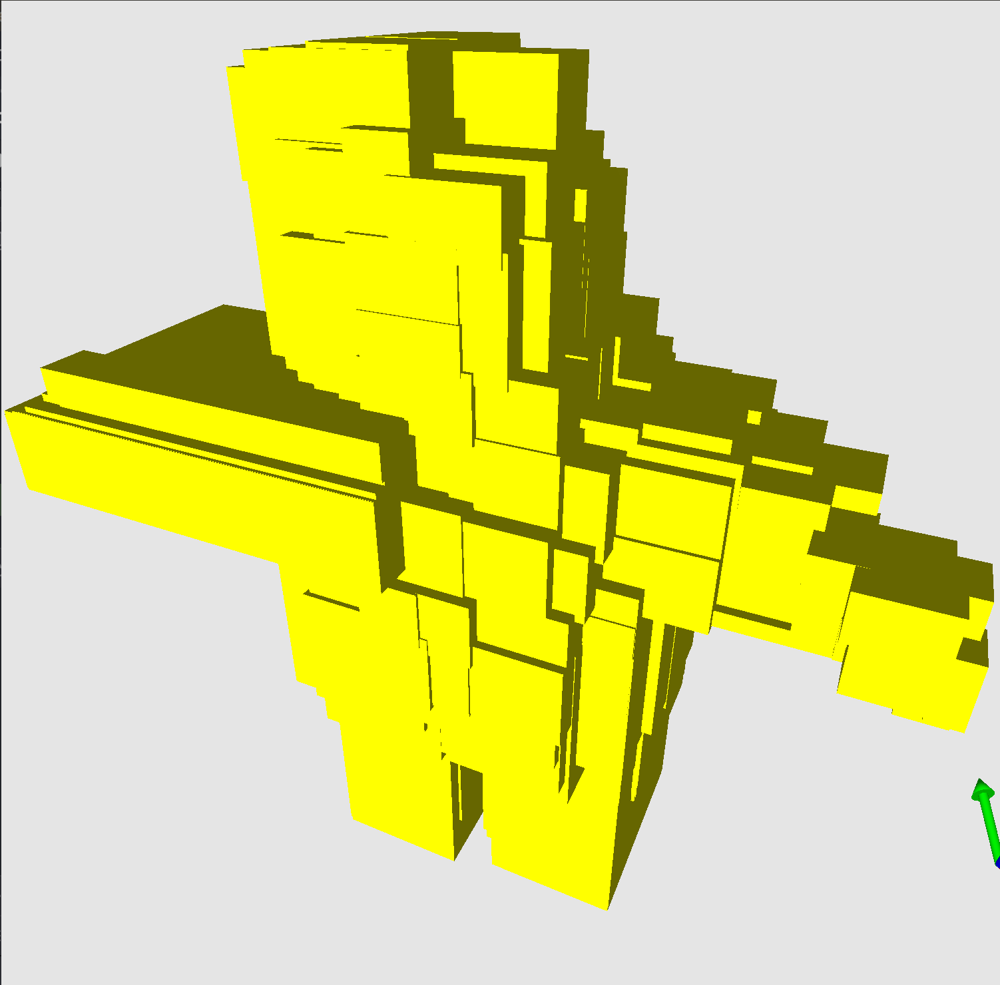
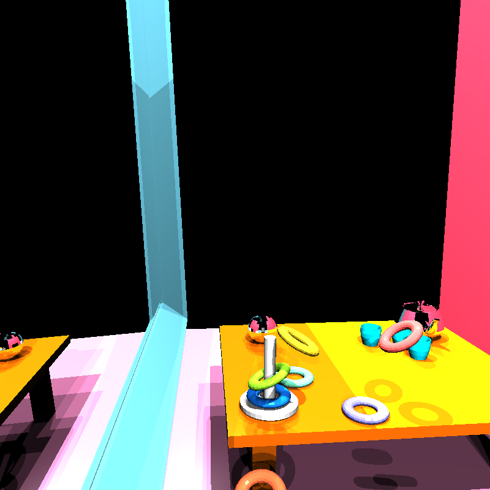
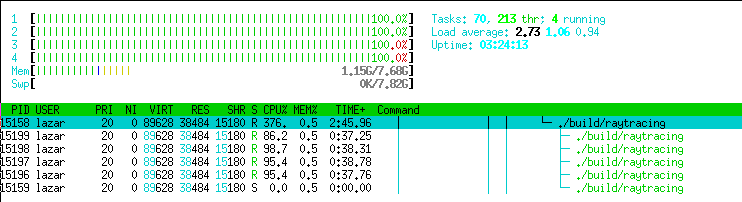
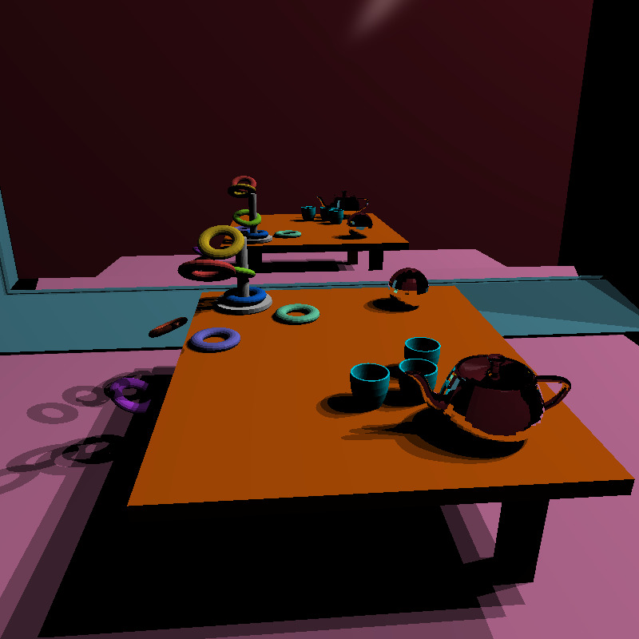

# Computer Graphics Project - Ray Tracing

#### run.sh

```
./run.sh    # normal build & run
./run.sh 0  # run the application without rebuilding
./run.sh 1  # rebuild everything with GDB debugger enabled
```

#### Debugging

- [a quick C++ debugging tutorial with GDB debugger](http://www.unknownroad.com/rtfm/gdbtut/gdbsegfault.html)
    - useful for debugging `segmentation fault`

##### Run

    gdb ./build/raytracing


#### REPORT


#### MINIMUM REQUIREMENTS

1. Perform ray intersections with planes, triangles, and bounding boxes.
	Joaquin, Lazer, Yanqing, Jacob



2. Computate shading at the first impact point (difuse and specular).
	Joaquin, Jacob



3. Perform recursive raytracing for refections to simulate specular materials. 
	Joaquin, Jacob, lazer


4. Calculate hard shadows from a point light. 
	Joaquin, Lazer, Moshiur, Yanqing, Jacob, Shivani


5. Calculate soft shadows from a spherical light centered at a point light.
	Joaquin,Shivani, Lazer, Moshiur, Yanqing, Jacob


6. Show an interactive display in OpenGL of the 3D scene and a debug ray tracer. A ray from a chosen pixel should be shown via OpenGL, illustrating the interactions with the surfaces. 
	Lazer


7. Implement a (simple) acceleration structure. 
	Jacob, Joaquin, Moshiur and Yanqing, Shivani, Lazer




8. Show a scene created by the group, exported as a wavefront object (OBJ) and directly loaded into the application.
	Shivani, Joaquin, Yanqing




 
EXTENSIONS 

1. Implementing a more complex scene hierarchy. 
	Shivani, Joaquin, Jacob, Moshiur, Yanqing, lazer

Pitures: code

2. Multicore support of the ray tracer (implementing additional threads).
	


3. A numerical evaluation of the performance of your ray tracer.
	Lazer

Picture: terminal


4. An illustration of interesting test or corner cases. 
	Joaquin, Shivani, Jacob, Yanqing


5. Extending the debugger to show the nth refection of a ray via the keyboard, or triggering a ray highlighting and showing command line output of the selected ray’s properties. 


#### Final image

